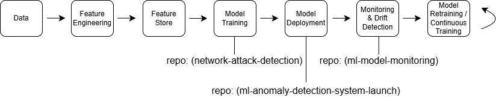

# Lee Bender

Machine Learning | Data Science | AI Systems

Technical Program Manager and Data Scientist building machine learning systems, data platforms, and AI infrastructure.

---

## Featured Projects

🔍 **Network Attack Detection**
- Isolation Forest anomaly detection model trained on CIC-IDS2017 network traffic data
- Feature engineering and anomaly scoring using Python and pandas
- Model evaluation using precision and recall metrics

🚀 **ML Anomaly Detection System**
- Architecture for deploying anomaly detection models in production environments
- Covers data ingestion, model inference, and monitoring workflows

📈 **Model Monitoring**
- Detect anomaly score drift and production data distribution changes
- Monitoring workflows for maintaining ML model performance

---

## Machine Learning Portfolio

| Project | Description | Tools |
|-------|-------------|------|
| [Network Attack Detection](https://github.com/benderla/network-attack-detection) | Detect anomalous network traffic using Isolation Forest | Python, Scikit-learn |
| [ML Anomaly Detection System](https://github.com/benderla/ml-anomaly-detection-system-launch) | End-to-end ML lifecycle from data ingestion to monitoring | Python, pandas, Scikit-learn, Git, Jupyter |
| [Model Monitoring](https://github.com/benderla/ml-model-monitoring) | Detect anomaly score drift and production data distribution changes | Python, Monitoring |

---

## Lifecycle Implementation

The repositories in this portfolio represent stages of the ML lifecycle:

Data Preparation & Feature Engineering  
→ network-attack-detection

Model Development & Evaluation  
→ network-attack-detection

Deployment Architecture  
→ ml-anomaly-detection-system-launch

Production Monitoring  
→ ml-model-monitoring

---

## Core Skills

Machine Learning
Python • Scikit-learn • Pandas • NumPy

Data Engineering
SQL • Feature Engineering • Data Pipelines

ML Systems
Model Monitoring • Drift Detection • ML Lifecycle

## Skills Demonstrated

• Machine learning pipeline development  
• Anomaly detection modeling  
• ML system architecture  
• Production monitoring and drift detection  
• Data engineering workflows  
• Technical program management

---

## Author

LinkedIn: [https://linkedin.com/leroy_mccoy/](https://www.linkedin.com/in/leroymccoy/)
