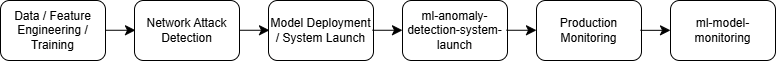
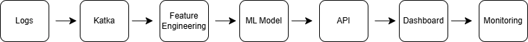

# Lee Bender

Machine Learning | Data Science | AI Systems

Technical Program Manager and Data Scientist building machine learning systems, data platforms, and AI infrastructure.

---

## Machine Learning Portfolio

| Project | Description | Tools |
|-------|-------------|------|
| [Network Attack Detection](https://github.com/benderla/network-attack-detection) | Detect anomalous network traffic using Isolation Forest | Python, Scikit-learn |
| [ML Anomaly Detection System](https://github.com/benderla/ml-anomaly-detection-system-launch) | End-to-end ML lifecycle from data ingestion to monitoring | Python, Pandas, ML Ops |
| [Model Monitoring](https://github.com/benderla/ml-model-monitoring) | Detect model drift and production anomalies | Python, Monitoring |

---

## ML Platform Architecture

This portfolio demonstrates the lifecycle of building, deploying, and monitoring a production machine learning system.

---

## Machine Learning Lifecycle

---

## Core Skills

Machine Learning
Python • Scikit-learn • Pandas • NumPy

Data Engineering
SQL • Feature Engineering • Data Pipelines

ML Systems
Model Monitoring • Drift Detection • ML Lifecycle

## Skills Demonstrated

• Machine learning pipeline development  
• Anomaly detection modeling  
• ML system architecture  
• Production monitoring and drift detection  
• Data engineering workflows  
• Technical program management

---

## Author

LinkedIn: https://linkedin.com/leroy_mccoy/
